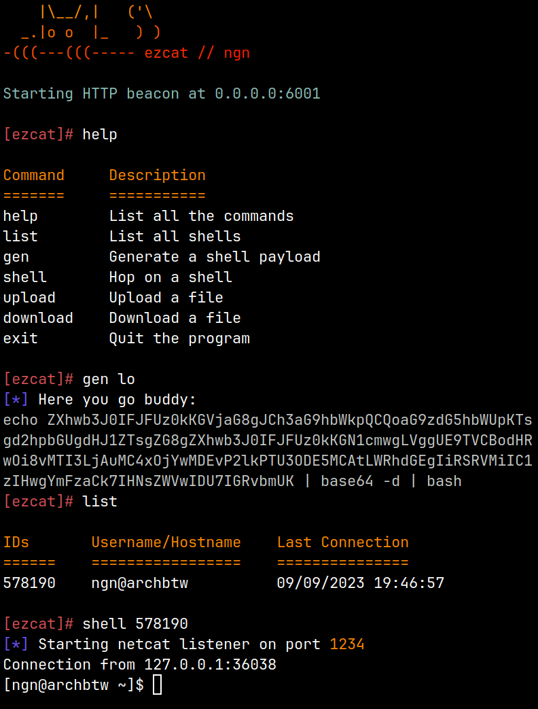

# Ezcat 🐱‍💻 Easy netcat reverse shell handler</h1>


Ezcat allows you to interact with mutliple netcat 
reverse shells and it lets you manage them easily  

---

### Features
- HTTP/HTTPS beacon
- Payload generation
- Simple CLI interface
- File upload & download
- Upgradable netcat shells

---

### Install
#### Automated installation 
For an automated installation, you can use the install script:
```bash
curl https://raw.githubusercontent.com/ngn13/ezcat/main/scripts/install.sh | sudo bash
```
#### Manual installation
Download the latest binary from the [releases tab](https://github.com/ngn13/ezcat/releases),
then copy it to somewhere in your `PATH`

---

### Build
Install a recent version of go (I recommend `1.20`), then clone the repository and run the go build 
command:
```bash
go build .
```

---

### Use
To run ezcat, simply run the command:
```
ezcat
```
this will start the HTTP beacon and put you in an interactive shell
to list the commands, run `help`:
```bash
Command     Description
=======     ===========
help        List all the commands
list        List all shells
gen         Generate a shell payload
shell       Hop on a shell
upload      Upload a file
download    Download a file
exit        Quit the program
```
if you want to run the HTTP beacon on a different port/interface, use the `HTTP_ADDR` enviroment
variable, for example:
```
HTTP_ADDR=127.0.0.1:1234 ezcat
```
#### HTTPS Beacon
In order to run the beacon over HTTPS, you can setup nginx or a similar proxy service,
here is an example nginx configuration:
```
server {
  server_name mycooldomain.com;

  location / {
    proxy_pass http://localhost:6001;
    proxy_http_version 1.1;
    proxy_set_header Upgrade $http_upgrade;
    proxy_set_header Connection 'upgrade';
    proxy_set_header Host $host;
    proxy_cache_bypass $http_upgrade;
  }
}
```
